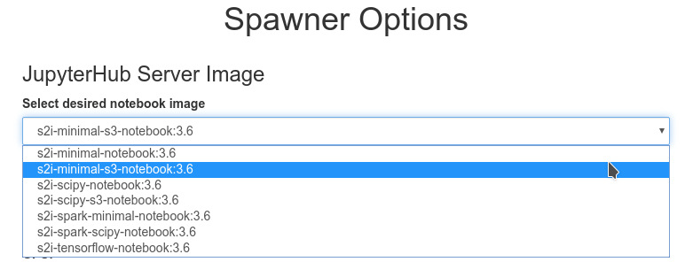

# Deploying ODH using OCS

These instructions will show you how to deploy Open Data Hub on top of storage provided by OpenShift Container Platform.

We will use two different types of storage:

- Persistent Volume Claim (PVC): standard filesystem where the users can store their notebooks, scripts,... A new PVC is automatically created for each user the first time they connect to JupyterHub and launch a notebook.
- Object Volume Claim (OBC): S3-compatible object storage where the users can store their data. A new OBC is automatically created for each user the first time they connect to JupyterHub and launch a notebook.

To do this we will customize the configuration of JupyterHub to implement the OBC creation automatically.

We will also create and use custom notebook images that will show both storage spaces in the same tree. That will be useful to have a quick look at the data that resides in the object storage, upload or download data,...

**Important Note**: even if the Object Storage space appears in the Jupyter file tree, it is not directly accessible through the Python kernel as it's not a filesystem. Outside from the tree view that allows for navigating/uploading/downloading, to interact with it in your code you have to use the boto3 library in Python, the s3a connector in Spark,...

However, all the necessary connection information are automatically populated as environment variables in the notebooks:

- S3_ENDPOINT_URL
- AWS_ACCESS_KEY_ID
- AWS_SECRET_ACCESS_KEY

## Prerequisites

I assume here that you will create a project called "odh" and that you are set to work with it. All the commands and configuration files are based on this asumption. If you use another project name, you will have to make the necessary changes.

## Operator image

The ability to use a custom config_map to add more configuration to JupyterHub is not present yet in version 0.5.0 of Open Data Hub. Therefore we will have to use a custom image until the relevant PR is accepted.
This image is at: quay.io/llasmith/opendatahub-operator:jupyterhub-config

There are two different ways to use this image:

1. Follow the steps here for a manual install of ODH: <https://gitlab.com/opendatahub/opendatahub-operator/blob/master/docs/manual-installation.adoc>
2. If you already have deployed the ODH operator, a quick and dirty hack is just to replace the image name in the odh-operator deployment. When you save the YAML it will redeploy with the new image (and OLM is not reversing this obviously, which is lucky for us):


## Role and Rolebinding

As JupyterHub will have to interact with configmaps and secrets created by OCS, we have to create a new role and rolebinding for the Service account it is using. We cannot patch the existing role as the operator would overwrite our modifications.

```bash
oc apply -f role_jupyterhub-hub-obc.yaml
```

## JupyterHub configuration Config Map

When JupyerHub starts, it reads its configuration from a file that ends with:

```python
# Load configuration included in the image.

image_config_file = '/opt/app-root/src/.jupyter/jupyterhub_config.py'

if os.path.exists(image_config_file):
    with open(image_config_file) as fp:
        exec(compile(fp.read(), image_config_file, 'exec'), globals())

# Load configuration provided via the environment.

environ_config_file = '/opt/app-root/configs/jupyterhub_config.py'

if os.path.exists(environ_config_file):
    with open(environ_config_file) as fp:
        exec(compile(fp.read(), environ_config_file, 'exec'), globals())
```

That means that it first loads the configuration file included in the image (which we do not want to change), then another coming from the environment. Which in our deployment is created through a Config Map. That's our opportunity!

In the previous versions of the operator this Config Map existed, but any change we made was reverted to the original configuration (an empty file).

With the new image version of the operator, we have the ability to use another Config Map providing our custom jupyterhub_config.py.

This file contains all the code necessary to create OBCs and retrieve configuration and secrets to connect a user to its bucket. Details are in the code, have a look at it! Then you can create the Config Map:

```bash
oc create cm jupyterhub-cfg2 --from-file=./jupyterhub_config.py -n odh
```

## Open Data Hub deployment

We are now ready to deploy Open Data Hub with the configuration that will use this new config map:

```bash
oc create -f odh-deploy.yaml
```

You can of course customize this file depending on your needs. The only thing you have to modify compared to the default example are those lines:

- `jupyterhub_configmap_name: jupyterhub-cfg2` (which is not in the default file)
- `s3_endpoint_url: https://s3-openshift-storage.apps.perf3.ocs.lab.eng.blr.redhat.com/`  (here you should enter your OCS S3 endpoint)
- `storage_class: ocs-storagecluster-ceph-rbd` (to make ODH use OCS block storage for user's spaces)

## Custom notebooks

As we have said before, we want the notebooks to show the buckets the user has access to. The way it works is important, because we won't only show the connected user's bucket, but also all he has been granted access too. That's a neat feature if you want to share data between users, set up some public repositories,... The only thing you have to do is manage access through the OCS/Noobaa dashboard.

Back to implementation. We will use here the S2I feature from OpenShift to build new notebooks which will integrate this bucket functionality.

First one is the minimal notebook build on top of the centos/python3.6 image. The provided file creates both the ImageStream and the BuildConfig:

```bash
oc create -f s2i-minimal-s3-notebook.yaml
```

Once we have this minimal image built, we can build the other ones upon it:

```bash
oc create -f s2i-scipy-s3-notebook.yaml
oc create -f s2i-tensorflow-s3-notebook.yaml
```

**Note**: if you want to create other images using the same technique, make sure all the ImageStreams end with "-notebook". That is how JupyterHub recognizes them and make them appear in the image selector when you start a new Jupyter instance.

## Result

If everytrhing went well, you should see all your images available in the selector:



